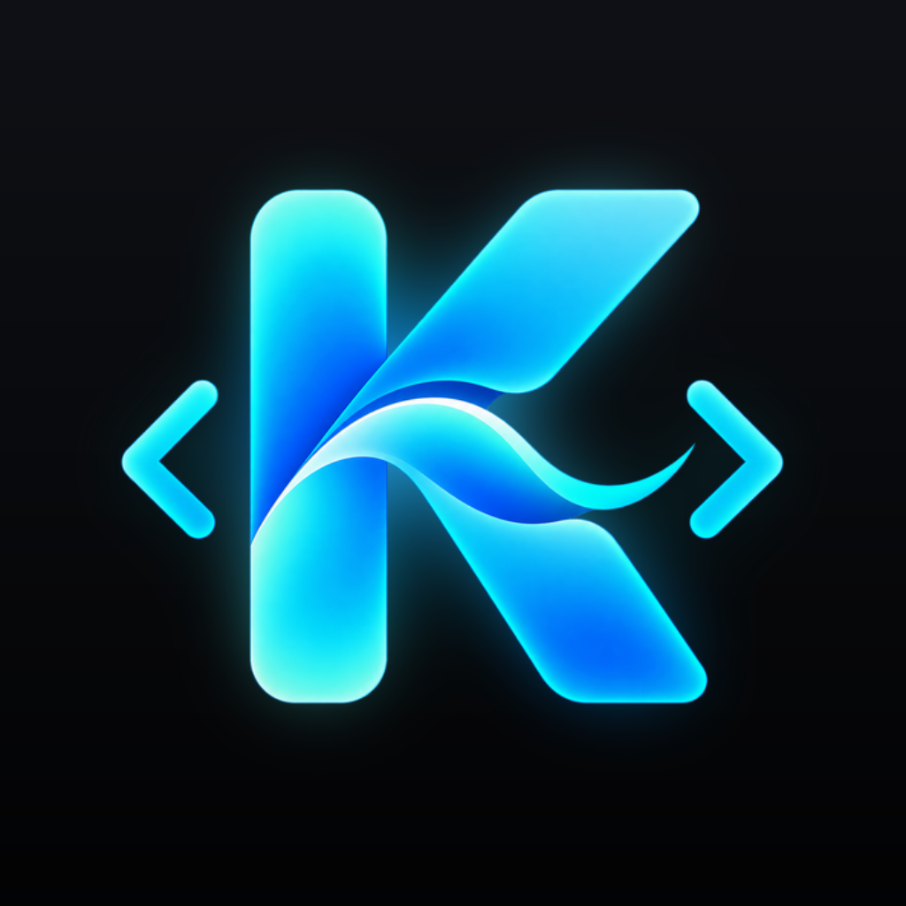

# 

# Kulula

A native macOS app that puts Claude Code, Codex, Google's Antigravity CLI and Apple's on-device model behind one chat window, with approval cards for every tool call and a pull request review loop.

This repository holds the released builds and the Sparkle update feed. The application is not open source; the source lives in a private repository.

## Install

Download the latest `.dmg` from [Releases](https://github.com/ricruss/kulula/releases), open it and drag the app to Applications. The app is signed with a Developer ID certificate and notarized by Apple. It checks this feed for updates once a day and never installs one without asking.

## One window, four engines

Add a repository, start a thread, type. Kulula runs the command line tools you already have — `claude`, `codex` and `agy` — as background processes and renders what they do in a single transcript: text, collapsible reasoning, tool calls with their output and exit code, and diffs per file. Apple's on-device model answers the short turns itself.

Threads sit in the sidebar under their repository, each showing which engine answered last, a spinner while a turn runs and a badge while something is waiting on you.

## Routing, and overriding it

Every turn is routed on device: quick questions stay local, edits go to Claude Code, second opinions go to Codex. The route and the reason for it show above the composer, and one click sends the same turn elsewhere.

To choose yourself, name the engine: `@claude`, `@codex`, `@agy` or `@local`. Add a model to pin it for the thread, as in `@claude:opus`.

## Approval cards

Nothing is written, run, committed or posted without a decision. Each request arrives as a card showing what was actually asked for: the command and its arguments, the paths it touches, the diff it wants to apply. Allow it, allow it for the session, allow it from now on, or deny it.

A standing grant covers the program and the paths it reaches rather than the text you approved, so approving one command does not let a differently spelled one through. Commands that provably only read need no approval. Grants stay listed and revocable in Settings.

When an engine wants to ask you something rather than ask permission, that arrives as its own card and waits for a real answer.

## A security level to match the task

One control in the composer sets how much the app answers on your behalf.

| Level | What it does |
|---|---|
| **Always Ask** | Asks for every call. Your grants are kept but not consulted. |
| **Approval Mode** | The default. Asks for everything except commands that provably only read, and the rules you made with "Always allow". |
| **Auto Mode** | Allows anything confined to the repository, including file writes and local git. Discarding uncommitted work still asks, and so does anything that leaves the machine. |

Merging a pull request, releasing, and any request to widen the app's own permissions ask at every level. Commands the app runs unattended are confined to the repository by the operating system, so a stray script cannot reach your home directory or another checkout.

## The pull request review loop

The inspector's Review tab turns a review into a worklist. Kulula watches the open pull requests on the current repository, and when a review arrives it groups the findings by severity with a file and line for each, including the ones left in replies and in the body of the review itself.

Per finding: fix it with an engine, ask Codex for a second opinion, reply only, or dismiss it. "Fix all" works a severity at a time. Fixes run in the thread you are already in, with the usual cards, and the diffs render inline.

Shipping is one card: a commit message drafted on device, the push, and a reply on each finding. Approve, edit or skip each line, and the exact `git` and `gh` commands are shown before anything runs. A shipped fix resolves its review thread, so GitHub stays the record of what is still open and a thread someone reopens brings its findings back. Asking for a fresh review is the last step.

Open, Fixed, Dismissed and All filters each carry a count, and merged pull requests stay hidden until you ask for them.

## Auto Fix

The same loop left to run, with a cap on rounds and on minutes that both count down on screen. A round is fix, build, test, and optionally a fresh review. It stops on either cap, on a round that changed nothing, or on a build that fails. It works within the permissions you have already given and never grants itself anything, so on a machine with no grants it is exactly as interactive as clicking Fix yourself.

## Threads that stay on their branch

A thread is bound to the branch it works on and, when the work came from a review, to its pull request. Before a fix, commit, push, reply or merge, Kulula checks that the branch, the pull request and the checkout agree. If they do not it blocks the action and offers a way back rather than acting on the wrong code. Reading and discussing another pull request stays safe.

Switching the checkout needs a clean tree and no running turn, and is previewed first. Work you have not committed is never stashed or discarded for you.

## Handoffs, and picking up where you left off

When a thread moves to another engine, the on-device model writes a short brief — the goal, the files touched, what was decided, what is still open — and hands it over, since neither engine can see the other's context. The brief appears in the transcript.

Everything is stored locally. Quit and reopen, and threads, transcripts, grants and both CLI sessions resume.

## Engine status

The Status tab lists each engine, whether it is available, the plan usage it reports, and a warning when an installed tool has drifted from the version the build was tested against.

## Requirements

- macOS 26 or later with Apple Intelligence enabled.
- The `claude`, `codex` and `agy` command line tools installed and logged in.

Kulula runs on the plans you already have and adds no subscription of its own. Antigravity needs a one-time approval hook, which Settings installs for you.

## Terms

The binaries are provided as is, for personal use, all rights reserved. No warranty.
